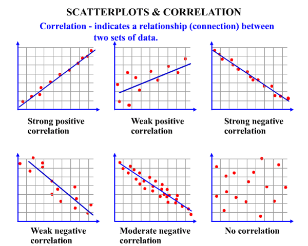

# Avoiding Misunderstanding Data: Correlation vs Causation

Published Date: March 18, 2025
Tags: Data Analytics, Featured

The quote from Richard Hamming (1962), *“The purpose of computing is insight, not numbers,”* describes the importance of understanding what the data truly represents — the story behind the numbers. In his book, he stated that it’s not just about reading and processing data, but about understanding when and why the results appear. Data should be tightly bound to the problem it intends to solve. A clear goal is essential to build an effective framework for extracting insights. However, one common pitfall in data interpretation is the confusion between **correlation** and **causation**.

Correlation and causation are the metrics that data analysts or decision-makers use to make decisions. Correlation, by definition, describes the degree to which two variables move in relation to each other. For example, if you have a dataset between daylight period and temperature, we can conclude, intuitively, that daylight period and temperature are positively correlated. On the contrary, causation indicates that one event is the result of the occurrence of the other event. One important thing to remember is that just because two data are correlated to each other, does not mean the two data have causal relationship. 

One of the famous research by Prinz (2020) highlights the danger of misinterpreting correlation as causation. He discussed evaluating a report about the positive correlation between chocolate consumption and Nobel laureates per capita (as claimed by Messerli, 2012). It stated that even though there was a positive correlation between those variables, no mechanism was found between them. Prinz concludes that either there are hidden variables that are correlated with them or the correlations are accidental or coincidental. This case is a perfect example of thinking fallacy: Cum Hoc Ergo Propter Hoc (with this, therefore because of this) and Post Hoc Ergo Propter Hoc (after this, therefore because of this). It can be falsely assumed that eating more chocolate improves cognitive abilities, leading to Novel-worthy achievements easily.

This leads us to a broader understanding of what data science really does. In principle, data science tackles three core tasks:

- Descriptive analysis – What is happening?
- Predictive modeling – What will happen?
- Causal inference – What would happen if we intervene?

Let’s say we have three variables: X, Y, and Z. In the real world, these variables follow an unknown causal process. All we observe are the outcomes — the data. We don’t see the underlying structural causal model or the joint probability distribution. Thus, the data scientist’s job is to infer these structures from the data.

## Measuring Correlations

The most common way to measure correlation is using Pearson’s correlation coefficient, which has been normalized ranging from -1 to +1, with this equation:

$$
r = \frac{\sum_{i=1}^{n} (x_i - \bar{x})(y_i - \bar{y})}{\sqrt{\sum_{i=1}^{n} (x_i - \bar{x})^2 \sum_{i=1}^{n} (y_i - \bar{y})^2}}
$$

Where:

- $r$ = correlation coefficient
- $x_i$ and $y_i$ = individual sample points
- $\bar{x}$ and $\bar{y}$ = sample means
- $n$ = sample size

The correlation coefficient indicates:

- +1: Perfect positive correlation
- 0: No correlation
- -1: Perfect negative correlation

Figure 1 shows the typology of correlations.

However, correlation does not imply a directional or causal effect. That's where causal analysis comes into play.

## Causal Analysis

The claim of the relation between two correlated variables does not mean they have causal relationships is not 100% true. Reichenbach published his Common Cause Principle, saying that if two variables — A and B — are dependent, then either A causes B, B causes A, or something else causes both A and B; meaning that if two variables are correlated, the variables might have direct causal relationships, or if there aren’t, some other variables causes both variables, this is called as confounding variables. Causal analysis can be approached from two methods: Causal Inference and Causal Discovery. 

The very practical questions on causal inference are “did the treatment directly help those who took it?”, “was it the marketing campaign that lead to increased sales this month or the holiday?”, “how big of an effect would increasing wages have on productivity?”. These questions root the same intuition, wanting to know the effect of a treatment or intervention on an outcome.  There are two main frameworks for causal estimation: Potential outcomes and structural causal models.

### Potential Outcomes

One of the methods of experiment methods is Randomized Controlled Trials (RCTs). Let’s do some experiments: say that we have a group of people who got sick. Let’s divide them equally and the first group, called Treatment (T or T=1), was given a medicine and the second group, called Control (C or T=0), was not given a medicine. We can check that 

Causal Discovery examines the data and deducing how variables are causally linked to each other.