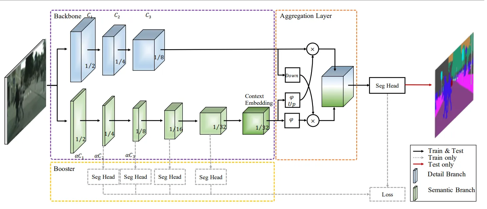

# Getting Deeper on BiSeNet-V2

Published Date: March 18, 2025
Tags: Computer Vision, Machine Learning

Semantic segmentation is an essential area of research in computer vision. The main goal is to classify each pixel in an image into categories like trees, cars, or buildings. This capability is valuable for applications such as self-driving cars and road detection.

For accurate semantic segmentation, two key aspects must be considered: spatial context and receptive field. Spatial context captures high-resolution spatial information, while the receptive field captures categorical semantic information.

## **Previous Implementation**

In general practice, the Fully Connected Network (FCN) is the leading architecture for accuracy. FCN's effectiveness stems from its backbone, which comes in two types: (i) dilation backbone network and (ii) encoder-decoder backbone network. The dilation backbone, used in DeepLabv3, preserves high-resolution features by removing downsampling operations and upsampling convolution filters. The encoder-decoder backbone, used in U-Net and SegNet, recovers high-resolution features through additional top-down and lateral connections. However, these backbones require expensive computation as they process low-detail and high-level semantics simultaneously.

The main drawback of these architectures is their simultaneous processing of spatial context and receptive field (semantic information). This approach makes the process computationally intensive since spatial context extraction requires small-stride computations.

## **BiSeNet V2 Architecture**

Fig 1. BiSeNet V2 Architecture

BiSeNetV2 was developed alongside other real-time semantic segmentation networks like E-Net and SegNet to maintain high semantic accuracy while achieving faster inference speeds. BiSeNetV2 processes low-level details and high-level semantics separately. Its backbone consists of two branches: the details branch and the semantic branch, as shown in Fig 1. The details branch extracts spatial information (low-level), while the semantic branch captures high-level semantics. These are followed by an aggregation layer and segmentation head.

Fig 2. BiSeNet V2's Backbone Configuration Details

### Detail Branch

This branch features wide channels and shallow layers to prevent information suppression by the convolution networks. Since it focuses on low-level details, it encodes images with small strides. The branch comprises three stages of convolution networks outputting 1/8 of the input size, followed by a batch normalization layer and ReLU activation function.

### Semantic Branch

While the detail branch processes spatial information, the semantic branch computes semantic classes using large strides, enabling faster inference. It employs a fast-downsampling strategy and global average pooling to enlarge the receptive field. This branch contains three components: stem block, gather-and-expansion block, and context embedding layer.

### Stem Block

### Gather-and-Expansion Block

The gather-and-expansion block is a crucial component for enhancing feature representations. It consists of two key operations:

1. **Gathering operation:** Uses depth-wise convolutions to capture local features and preserve fine details.
2. **Expansion operation:** Expands the receptive field using dilated convolutions to incorporate more global information, balancing efficiency and accuracy.

### Context Embedding Block

The context embedding block captures the global context of an image by applying global average pooling and feeding the output into a fully connected layer. This block helps improve segmentation accuracy by refining the semantic information extracted from the image.

### Aggregation Layer

Because of the fast-downsampling strategy in the semantic branch, its output is smaller than the detail branch's output. Therefore, the semantic branch output must be upsampled to match sizes. The aggregation layer then combines the outputs from both branches.

## What Makes BiSeNet-V2 Great?

BiSeNetV2 outperforms traditional semantic segmentation architectures in terms of speed and efficiency. The key advantages include:

1. **Higher Efficiency:** Unlike traditional FCNs, BiSeNetV2 reduces computational cost by processing spatial and semantic features separately.
2. **Real-Time Performance:** With separate detail and semantic branches, BiSeNetV2 achieves near real-time inference, making it suitable for applications like autonomous driving.
3. **Better Accuracy:** By employing global context embedding and feature fusion, BiSeNetV2 achieves high segmentation accuracy comparable to more complex models like DeepLabv3 and U-Net.

## Conclusion

BiSeNetV2 represents a significant advancement in real-time semantic segmentation, providing a balance between accuracy and efficiency. Its dual-branch architecture effectively separates spatial and semantic processing, making it a suitable choice for high-speed applications. As research progresses, further optimizations and hybrid architectures could push the boundaries of real-time segmentation even further.