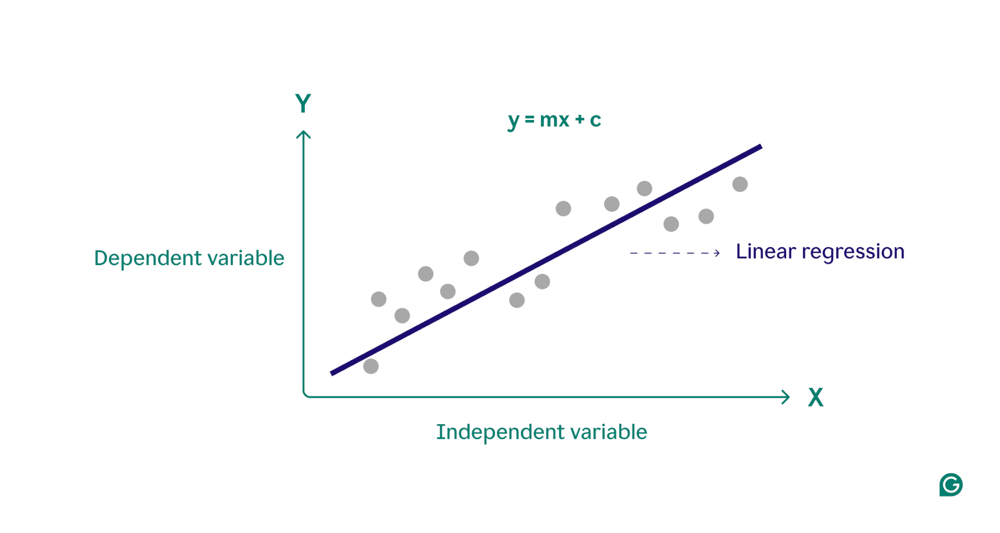
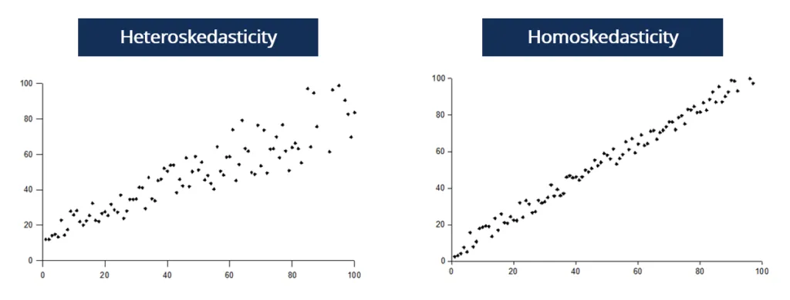
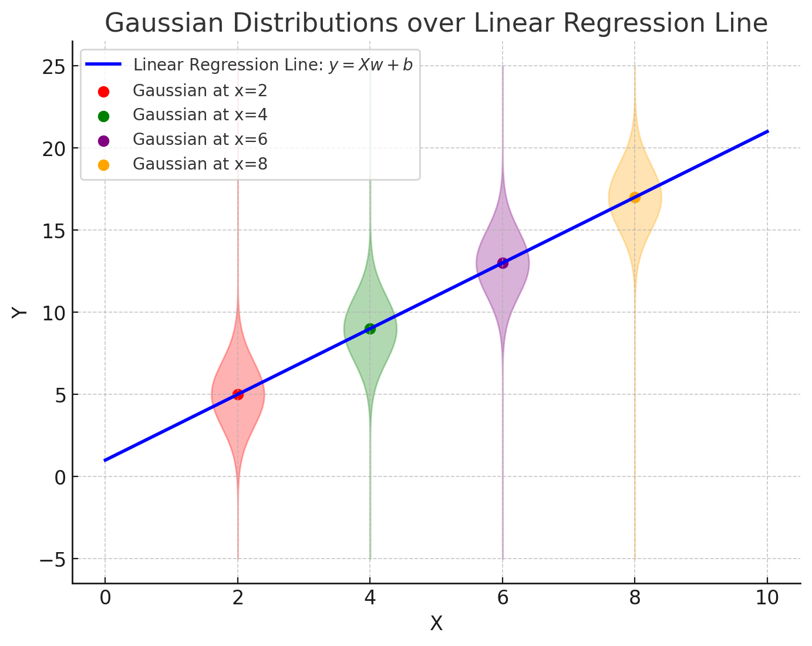

# Mathematical Justification on Linear Regression

Published Date: March 17, 2025
Tags: Featured, Machine Learning

In machine learning, **linear regression** is one of the most fundamental and widely used models. It is a **deterministic model**, meaning that for a given set of input features, it always produces the same output without randomness. It establishes a **linear relationship** between the input variables and the target variable, making predictions based on learned weights.

This article discusses the **mathematical justification** behind linear regression in depth, starting from the **concept of linear regression**, moving on to the **mathematical formulation of the least square error (LSE)** and its justification, and finally discussing **Maximum A Posteriori (MAP) estimation**, **closed-form solutions**, and **regularization techniques.**

## Understanding Linear Regression

Linear regression is a method used to model the relationship between one or more input features and a target variable. Given a multivariable of input $\bold{x}$ and an output of $y$, the model will assume a linear dependency between them as the following equation where n is the number of input features.

$$
y=w_0 + w_1x_1+w_2x_2+...+w_nx_n
$$

or in vector notation:

$$
\bold{y} = \bold{X}\bold{w}
$$

notice that $\bold{X}$ is an $N \times D$ dimension matrix, where  $N$ is the number of data points and $D$ is a number of input features; $\bold{w}$ is the weight vector; and $\bold{y}$ is the predicted output. Figure 1 is an example of linear regression. From the picture, we know that the predicted outputs (blue line) remain unchanged as the inputs remain the same. This is what deterministic models mean. 

Another thing to look at is that there are always some errors between the actual data (x,y) and the predicted values. Intuitively, we would want to minimise the errors. But, how do we achieve that?

Figure 1. Linear Regression (Source: Grammarly.com)

## Least Square Error

One widely used metric to answer that is by using least square error (LSE). LSE measures the sum of the squared differences between the actual and the predicted values. When performing linear regression, we usually want to minimise the least square error. While the idea is intuitively acceptable, it still needs to be explained mathematically as to why LSE is used widely.

The Least Square Error (LSE), also known as the Sum of Squared Errors (SSE), is a mathematical method used to measure the difference between predicted values and actual observed values in a dataset. It's calculated by:

1. Taking the difference between each predicted value (ŷ) and actual value (y)
2. Squaring these differences
3. Summing up all the squared differences

$$
LSE = \min\sum_{i=1}^{n} (y_i - \hat{y}_i)^2
$$

where:

- $n$ is the number of observations
- $y_i$ is the actual value for the i-th observation
- $\hat{y_i}$ is the predicted value for the i-th observation

The squaring operation serves two important purposes:

- It ensures all terms are positive, preventing negative and positive errors from canceling each other out
- It penalizes larger errors more heavily than smaller ones, making the model more sensitive to outliers

Although LSE seems reasonable, it still does not answer the justification why it is acceptable to be widely used. The key is on the **data and weights assumptions.**

The goal of regression is to find the best weights ($\bold{w}$) to represent the data. This means we need to maximize the probability of the weights given the data, $p(\bold{w}|\mathcal{D})$, which is represented as: 

$$
\bold{w_{MAP}^\ast} =\argmax_\bold{w}{p(\bold{w}|\mathcal{D})}
$$

This approach is known as MAP (Maximum A Posteriori) estimation. By using Bayes’ Rule, we obtain:

$$
p(\bold{w}|\mathcal{D}) = \dfrac{p(\mathcal{D}|\bold{w})p(\bold{w})}{p(\mathcal{D})}
$$

which is saying that we can find the posterior by the probability of “how likely is the data $\mathcal{D}$ given the weights are established”, which is called *likelihood*, times the prior assumption of the probability distribution of weights, which is called *prior*. 

Since the $p(\mathcal{D})$ is independent of $\bold{w}$, we only focus on the numerator. The function we maximise simplifies to:

$$
\log{p(\bold{w}|\mathcal{D})}\propto \log{p(\mathcal{D}|\bold{w})} + \log{p(\bold{w})}
$$

Figure 2. Gaussian Distribution over Linear Regression Line

From here, let’s assume that the prior distribution of weights is a uniform distribution, resulting the second term becoming constant. We can omit the $\log{p(\bold{w}})$, resulting in maximising the posterior is actually the same as maximising the likelihood. So what does the probability distribution of likelihood look like? Yes, it’s *Gaussian,* which is shown in the following equation. However, the question is why the $\mu$ is $\bold{Xw}$ ? Remember the regression line in the Figure 1? The line represents the highest probability of y given the input $\bold{X}$ and weights $\bold{w}$. We can imagine every point in the line is the highest point in a Gaussian distribution stretching out the y-axis, as illustrated in Figure 2.

$$
\log{p(\mathcal{D}|\bold{w})}=\log{p(\bold{y}|\bold{X},\bold{w})}=\log{ \mathcal{N}(\bold{y},\bold{Xw},\sigma_y^2)}=\log{\dfrac{1}{\sigma_y \sqrt{2\pi}}} - \dfrac{1}{2\sigma_y^2}(\bold{y}-\bold{Xw})^2
$$

Finally, we can see that we can only maximise the second term. Furthermore, in this case, we assume that the data is homoscedasticity, meaning that the variance of y ($\sigma_y$) is the same for all points of y. The Figure 3 is the difference between homoscedasticity and heteroscedasticity. By this assumption, we can omit the variance, hence only results in the following equation.

$$
\log{p(\mathcal{D}|\bold{w})}=-(\bold{y}-\bold{Xw})^T(\bold{y}-\bold{Xw}) = -\sum_{i=0}^n{(y^{(i)} -w^{(i)}x^{(i)})^2}
$$

since we’re maximising the log likelihood, we can say that we want to minimise the sum of the quadratic of the actual data and the predicted data difference, which is the same concept as the least square error.

$$
\bold{w_{MLE}} = \argmin_\bold{w} \sum_{i=0}^n(y^{(i)}-{w^{(i)}x^{(i)}})^2
$$

What if the variance of y is not the same for all points in y? If we still use the lease square error, then the linear regression will not be accurate, showing a high residual between the predicted and actual values. One of the solutions is by using weighted least square errors.

Figure 3. Homoscedasticity vs Heteroscedasticity

## Closed-Form Equation

There is an optimal weights vector in least squares regression that can be found using the closed-form solution. Let’s assume that the previous equation is called $\bold{r}$ (residuals). What we want to do is to differentiate over the weights to close to $\bold{0}$.

$$
\bold{r^Tr}=(\bold{y}-\bold{Xw})^T(\bold{y}-\bold{Xw})=\bold{y^Ty}-2\bold{w^TX^Ty}+\bold{w^TX^TXw}
$$

$$
\bold{\triangledown_w}[\bold{r^Tr}] = -2\bold{X^Ty}+2\bold{X^TXw}=\bold{0}
$$

from here, we can get the optimal weights by the following equation:

$$
\bold{w}=(\bold{X^TX})^{-1}\bold{X^T}\bold{y}
$$

if and only if the $(\bold{X^TX})$  is invertible.

## Regularization

Why do we need regularization? When there are too many features, the model can become overfitted and fail to generalize the data. Then, what we can do is to limit the features so it won’t affect much on the output values. How do we do it? By limiting the range of weights. Remember that in LSE, we assume that the prior of weights is an uniform distribution, meaning that the value can go up to minus infinity to infinity. What if we want the weights to be close to zero? The answer is to change the prior distribution. There are two ways we can do it:

1. If we want some weights to be exactly zero, meaning that there will be some features that are omitted.
2. If we shrink all the weights, but keep them non-zero.

The first method is by assuming that the $p(\bold{w})$ is a Laplace prior:

$$
p(\bold{w})\propto \exp(-\alpha|\bold{w}|)
$$

From there we can substitute to the MAP equation and get that the loss will be:

$$
\mathcal{L}_{Lasso}=(\bold{y}-\bold{Xw})^2+\lambda||\bold{w}||
$$

This regularization method is called L1 Regularization or Lasso Regression. This method is useful for feature selection.

For the second method, we can assume that the $p(\bold{w})$ distribution is a Gaussian with a mean of zero and a variance of one:

$$
p(\bold{w})\propto \exp(-\frac{\bold{w}^2}{2})
$$

we can obtain the loss regression will be:

$$
\mathcal{L}_{Ridge}=(\bold{y}-\bold{Xw})^2+\lambda||\bold{w}||^2
$$

This method is called L2 Regularization or Ridge Regression. This method is suitable when all features contribute to the prediction.

## Conclusion

Linear regression is a **deterministic model** that predicts outcomes based on weighted input features. The **Least Square Error (LSE)** is commonly used as a loss function because it corresponds to **Maximum Likelihood Estimation (MLE)** under Gaussian noise assumptions.

When computing the optimal weights, we can use:

- The **closed-form solution (normal equation)** for small datasets.
- **Gradient descent** for large datasets.

To **prevent overfitting**, **regularization** techniques are applied:

- **L2 regularization (Ridge)** shrinks weights but keeps all features, which assumes the prior to be a Gaussian distribution
- **L1 regularization (Lasso)** forces some weights to **exactly zero**, performing automatic feature selection, which assumes the prior to be a Laplace distribution.

Understanding these concepts provides a **strong foundation** for applying linear regression effectively in real-world machine learning tasks.